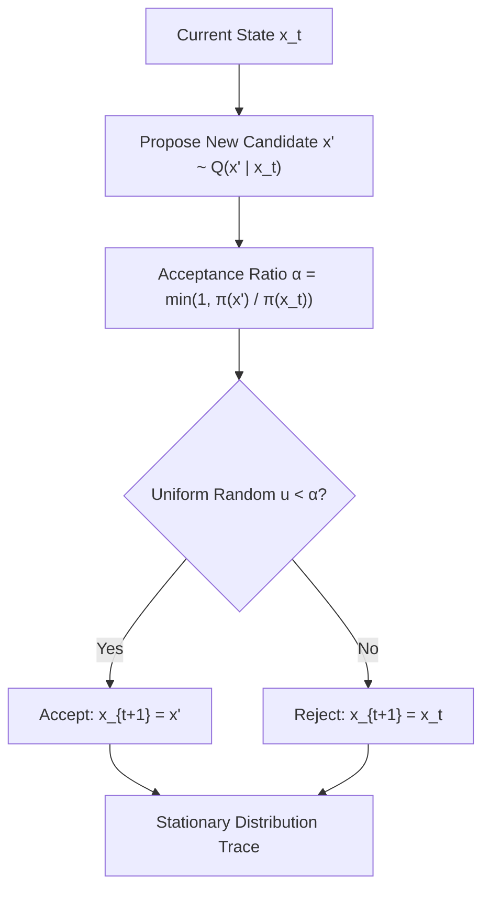

# Metropolis-Hastings MCMC Sampler Skill

Markov Chain Monte Carlo (MCMC) sampler for Bayesian posterior estimation and high-dimensional probabilistic distribution exploration.

## Features
- **100% Python Standard Library**: Unnormalized log-probability evaluation.
- **Detailed Balance Guarantee**: Provable asymptotic convergence to true target density.
